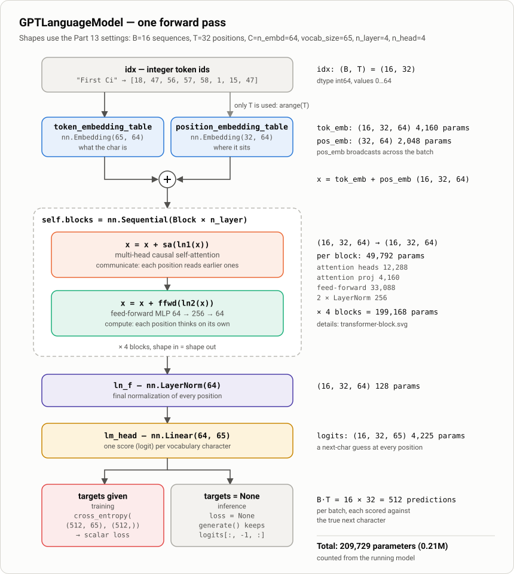
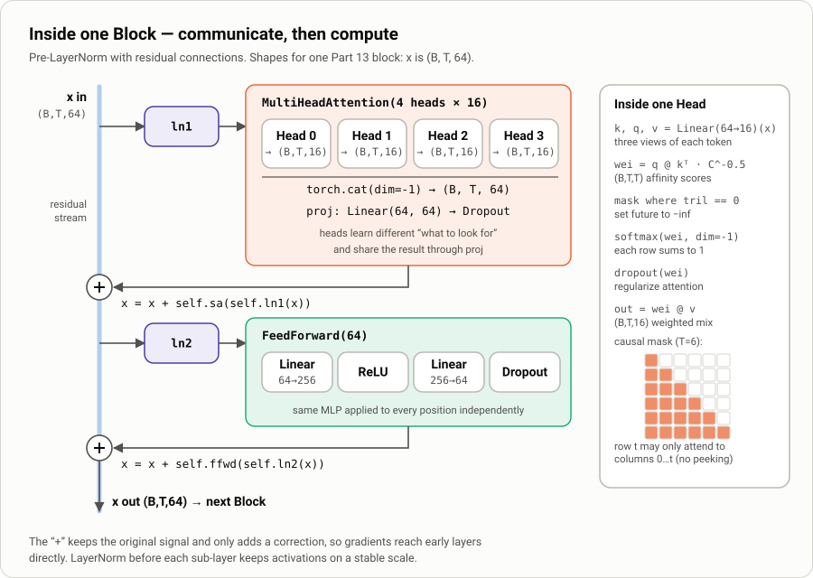
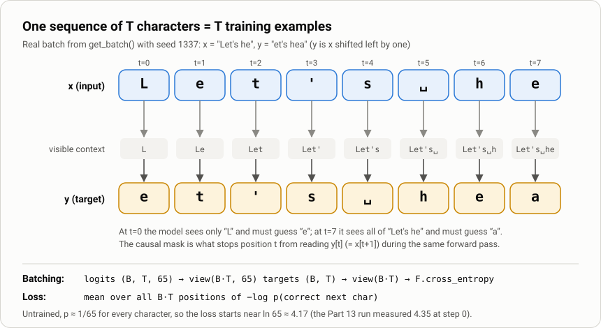

# 1. `GPTLanguageModel`: the whole model in one class

> Notebook: [`src/Chapter_2__build_GPT_from_scratch.ipynb`](../../src/Chapter_2__build_GPT_from_scratch.ipynb), **Part 12: The Complete GPT Model**
> Next: [2. Training](02-training.md) · [3. Inference](03-inference.md)

By Part 12 the notebook has built every piece of a transformer: `Head`, `MultiHeadAttention`, `FeedForward`, and `Block`. `GPTLanguageModel` connects them into a model that does one thing:

> **Given a sequence of characters, output a score for every possible next character at every position.**

Training, sampling and loss all build on that one operation.



---

## The code

```python
class GPTLanguageModel(nn.Module):
    def __init__(self):
        super().__init__()
        self.token_embedding_table = nn.Embedding(vocab_size, n_embd)
        self.position_embedding_table = nn.Embedding(block_size, n_embd)
        self.blocks = nn.Sequential(*[Block(n_embd, n_head=n_head) for _ in range(n_layer)])
        self.ln_f = nn.LayerNorm(n_embd)
        self.lm_head = nn.Linear(n_embd, vocab_size)

    def forward(self, idx, targets=None):
        B, T = idx.shape
        tok_emb = self.token_embedding_table(idx)                                    # (B, T, C)
        pos_emb = self.position_embedding_table(torch.arange(T, device=idx.device))  # (T, C)
        x = tok_emb + pos_emb                                                        # (B, T, C)
        x = self.blocks(x)
        x = self.ln_f(x)
        logits = self.lm_head(x)                                                     # (B, T, vocab_size)
        ...
```

## The letters B, T, C, V

Every comment in the notebook uses the same four letters. With the Part 13 hyperparameters:

| Symbol | Meaning | Variable | Part 13 value |
|---|---|---|---|
| **B** | batch: independent sequences processed together | `batch_size` | 16 |
| **T** | time: positions (characters) per sequence, at most `block_size` | `block_size` | 32 |
| **C** | channels: size of the vector that represents one position | `n_embd` | 64 |
| **V** | vocabulary: number of distinct characters | `vocab_size` | 65 |

A tensor of shape `(B, T, C)` is "16 sequences × 32 positions × a 64-number vector at each position".

---

## `__init__`: the five parts

### 1. `token_embedding_table = nn.Embedding(vocab_size, n_embd)` (what the character is)

An `nn.Embedding` is a learnable lookup table with 65 rows of 64 numbers. Token id `47` (`'i'`) returns row 47. The rows start random and are trained so that characters that behave alike end up with similar vectors.

*Compare with the bigram model:* there the table was `nn.Embedding(vocab_size, vocab_size)`, so each row was the next-character scores themselves. Here a row is only a 64-dim *representation*; the scores come later from `lm_head`.

### 2. `position_embedding_table = nn.Embedding(block_size, n_embd)` (where the character sits)

Attention has no built-in sense of order: it treats its inputs as a *set* of vectors. (See Dr. Liu's notes in Part 11: "There is no notion of space.") Without position information, "dog bites man" and "man bites dog" would look the same to the model.

The model learns one vector per slot `0 … block_size-1` and adds it to the token vector. So an `e` at position 3 and an `e` at position 20 enter the blocks as different vectors.

> Because this table has exactly `block_size` rows, the model **cannot** take more than `block_size` positions as input. That is why `generate()` crops its context (see [Inference](03-inference.md)).

### 3. `blocks = nn.Sequential(*[Block(...) for _ in range(n_layer)])` (the transformer)

There are `n_layer` identical blocks, applied in order. Each block does two things, each wrapped in a residual connection:

1. **Communicate:** `x = x + sa(ln1(x))`. Multi-head causal self-attention lets every position collect information from the positions *before* it.
2. **Compute:** `x = x + ffwd(ln2(x))`. A small MLP (64 → 256 → 64) then processes each position on its own.



A block maps `(B, T, C) → (B, T, C)`. The shape never changes, which is why blocks can be stacked to any depth. Each block can build on the patterns found by the one before it.

### 4. `ln_f = nn.LayerNorm(n_embd)` (final normalization)

The blocks normalize *before* each sub-layer (pre-LN), so the output of the last block has not been normalized yet. `ln_f` normalizes it once more before the output layer.

### 5. `lm_head = nn.Linear(n_embd, vocab_size)` (back to vocabulary scores)

This layer turns each 64-dim vector into **65 logits**, one raw score per character. Higher means more likely next. The logits are not probabilities yet; `softmax` converts them later, both inside `cross_entropy` and inside `generate`.

---

## `forward(idx, targets=None)`: one pass, two modes

### Step by step, with shapes

| Line | Output shape | What happens |
|---|---|---|
| `idx` | `(16, 32)` | integer ids, e.g. `"First Ci" → [18, 47, 56, 57, 58, 1, 15, 47]` |
| `tok_emb = token_embedding_table(idx)` | `(16, 32, 64)` | look up a vector for every id |
| `pos_emb = position_embedding_table(arange(T))` | `(32, 64)` | one vector per position 0…31 |
| `x = tok_emb + pos_emb` | `(16, 32, 64)` | **broadcasting**: the same position vectors are added to all 16 sequences |
| `x = blocks(x)` | `(16, 32, 64)` | 4 rounds of attention + MLP |
| `x = ln_f(x)` | `(16, 32, 64)` | normalize |
| `logits = lm_head(x)` | `(16, 32, 65)` | a next-character guess at **every** position |

The model predicts at all 32 positions at once, not only the last one. A single forward pass on one `(B, T)` batch therefore gives `B × T = 512` predictions to learn from. The causal mask in each `Head` keeps this honest: position `t` can only see positions `0…t`, so it cannot read the answer.

### Mode A: training (`targets` given)

```python
B, T, C = logits.shape
logits  = logits.view(B*T, C)     # (512, 65)
targets = targets.view(B*T)       # (512,)
loss = F.cross_entropy(logits, targets)
```

`F.cross_entropy` expects a 2-D `(N, classes)` tensor and a 1-D `(N,)` tensor, so the batch and time axes are flattened into one. For each of the 512 rows it computes `-log softmax(logits)[correct_char]` and returns the mean, a single number.



**What the loss means.** A model that knows nothing gives each of the 65 characters probability 1/65, for a loss of `ln 65 ≈ 4.17`. In the notebook run, the untrained model measured **4.35**: random initial weights produce logits that are slightly *worse* than uniform. The loss falls during training to **≈1.90** on validation (see [Training](02-training.md)).

### Mode B: inference (`targets=None`)

The loss is skipped and `(logits, None)` is returned with the full `(B, T, 65)` shape. `generate()` calls `self(idx_cond)` this way and uses only the last position, `logits[:, -1, :]`.

> Note the return shape differs by mode: with targets, `logits` comes back flattened to `(B*T, V)`; without targets it stays `(B, T, V)`.

---

## Where the 209,729 parameters live

Counted from the instantiated Part 13 model (`n_embd=64, n_head=4, n_layer=4, block_size=32`):

| Component | Shape(s) | Parameters | Share |
|---|---|---:|---:|
| token embedding | 65 × 64 | 4,160 | 2.0% |
| position embedding | 32 × 64 | 2,048 | 1.0% |
| **4 × Block** | | **199,168** | **95.0%** |
| ↳ attention heads (Q, K, V for 4 heads) | 12 × (16 × 64) | 12,288 / block | |
| ↳ attention output `proj` | 64 × 64 + 64 | 4,160 / block | |
| ↳ feed-forward | 64×256+256 + 256×64+64 | 33,088 / block | |
| ↳ `ln1`, `ln2` | 4 × 64 | 256 / block | |
| `ln_f` | 2 × 64 | 128 | 0.1% |
| `lm_head` | 64 × 65 + 65 | 4,225 | 2.0% |
| **Total** | | **209,729** (≈0.21M) | |

Two things stand out:

- **The feed-forward layers hold two thirds of each block's parameters.** The same holds for full-size GPTs.
- **Attention weights do not depend on `T`.** The `(T, T)` attention matrix is computed from the data and is never stored as a parameter. Context length increases compute and memory, not parameter count. (The *position table* does grow with `block_size`.)

---

## Things to watch for in this notebook

1. **Hyperparameters are globals.** The classes read `vocab_size`, `n_embd`, `n_head`, `n_layer`, `block_size` and `dropout` from the notebook's global scope when an object is *constructed*. Defining the classes in Part 11–12 before the Part 13 cell sets these values works because nothing is built until `GPTLanguageModel()` runs. However, if you change `block_size` after building the model, `generate()` will crop to the new value while the position table still has the old size.
2. **`Block.forward` returns `x-0.5`** (Part 11 cell). The reference implementation in the "Full finished code" cell returns `x`. As written, each block shifts the whole residual stream by −0.5. The model still trains, but it is not a standard transformer block and is probably a typo.
3. **Attention scaling uses `C`, not `head_size`.** In `Head.forward`, `C` comes from `x.shape` and equals `n_embd` (64), so scores are multiplied by `1/8` instead of `1/√16 = 1/4`. This is inherited from Karpathy's original video code. It makes attention a bit softer and is harmless at this size, but the textbook formula is `head_size ** -0.5`.
4. **Two names, one model.** The "Full finished code" and "COMPLETE AND UPDATED" cells call this same architecture `BigramLanguageModel`. It is the GPT, not the Part 7 bigram model.
