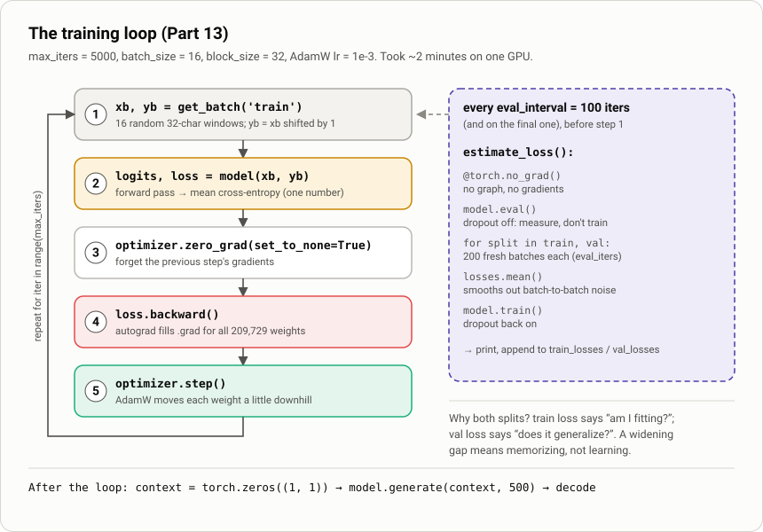
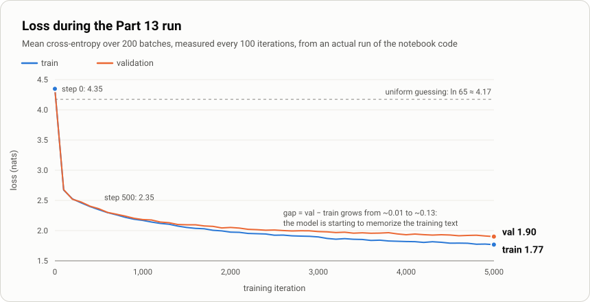

# 2. Training the GPT

> Notebook: [`src/Chapter_2__build_GPT_from_scratch.ipynb`](../../src/Chapter_2__build_GPT_from_scratch.ipynb), **Part 13: Training the Full Model**
> Previous: [1. The model](01-gpt-language-model.md) · Next: [3. Inference](03-inference.md)

Training does one thing over and over: **show the model real Shakespeare, measure how wrong its next-character guesses were, and nudge every weight to be slightly less wrong.** The Part 13 cell repeats this 5,000 times.



---

## The hyperparameters

```python
batch_size    = 16     # sequences per step                          (B)
block_size    = 32     # characters per sequence = max context        (T)
max_iters     = 5000   # optimizer steps
eval_interval = 100    # measure train/val loss every N steps
learning_rate = 1e-3
eval_iters    = 200    # batches averaged per loss measurement
n_embd        = 64     # vector size per position                     (C)
n_head        = 4      # attention heads per block (16 dims each)
n_layer       = 4      # transformer blocks
dropout       = 0.2    # (the cell sets 0.0, then overrides it with 0.2)
```

With these settings, one step processes `16 × 32 = 512` next-character predictions, so 5,000 steps see about **2.6M predictions**. That is about 2.5 passes' worth over the 1M-character training split. Because `get_batch` picks windows at random, though, it is not a strict epoch: some text is seen more often than other text.

---

## Step 0: data in, `get_batch`

```python
def get_batch(split):
    data = train_data if split == 'train' else val_data
    ix = torch.randint(len(data) - block_size, (batch_size,))        # 16 random start offsets
    x = torch.stack([data[i:i+block_size]     for i in ix])          # (16, 32)
    y = torch.stack([data[i+1:i+block_size+1] for i in ix])          # (16, 32), shifted by one
    return x.to(device), y.to(device)
```

- `train_data` is the first 90% of the encoded text (1,003,854 characters) and `val_data` is the last 10% (111,540).
- Each batch row is a random 32-character window. `y` is the same window shifted one character to the right, so `y[t]` is the correct answer for position `t`.
- `.to(device)` moves the batch to the GPU. Part 13 redefines `get_batch` only to add this line.

## The five-line inner loop

```python
for iter in range(max_iters):
    xb, yb = get_batch('train')                 # 1. sample
    logits, loss = model(xb, yb)                # 2. forward
    optimizer.zero_grad(set_to_none=True)       # 3. clear old gradients
    loss.backward()                             # 4. backpropagate
    optimizer.step()                            # 5. update weights
```

| # | Line | What it does |
|---|---|---|
| 1 | `get_batch('train')` | 16 fresh random windows from the training split. |
| 2 | `model(xb, yb)` | Runs the full forward pass ([doc 1](01-gpt-language-model.md)) and returns the mean cross-entropy over 512 predictions. PyTorch records every operation, building a computation graph. |
| 3 | `zero_grad(set_to_none=True)` | PyTorch **adds** new gradients to `.grad` instead of replacing them. Without this line, every step would also apply all earlier gradients. `set_to_none=True` frees the tensors instead of filling them with zeros, which is slightly faster. |
| 4 | `loss.backward()` | Walks the graph backwards (backpropagation) and fills `p.grad` for all 209,729 parameters with ∂loss/∂p: the direction in which each weight would increase the loss. |
| 5 | `optimizer.step()` | AdamW moves each weight a small step the *other* way. |

### Why AdamW?

`torch.optim.AdamW(model.parameters(), lr=1e-3)` is the default optimizer for transformers.

- **Adam** keeps a running average of each parameter's gradient (momentum) and of its squared gradient (scale). Each weight then gets its own adaptive step size, so rarely-updated embedding rows and constantly-updated attention weights both learn at a sensible rate.
- **W** stands for *decoupled weight decay*: every step it also shrinks weights slightly toward zero. This is a light regularizer. PyTorch's default is `weight_decay=0.01`.
- **`lr = 1e-3`** is high by large-model standards but fine for a 0.2M-parameter model. The cell passes the literal `1e-3` rather than `learning_rate`, so changing `learning_rate` has no effect unless you edit that line.

### Dropout during training

With `dropout = 0.2`, each `nn.Dropout` layer zeroes 20% of its inputs at random on every forward pass. This applies to attention weights, the attention output projection, and the feed-forward output. Because the model can't rely on any single path, it learns more robust features. Dropout is active only in `model.train()` mode.

---

## Measuring progress: `estimate_loss`

```python
@torch.no_grad()
def estimate_loss():
    out = {}
    model.eval()
    for split in ['train', 'val']:
        losses = torch.zeros(eval_iters)
        for k in range(eval_iters):
            X, Y = get_batch(split)
            logits, loss = model(X, Y)
            losses[k] = loss.item()
        out[split] = losses.mean()
    model.train()
    return out
```

The `loss` from step 2 of the loop is noisy: it is computed on one batch of 16 random windows, with dropout on. Every `eval_interval = 100` steps, and on the final step, the loop measures properly:

- **`@torch.no_grad()`**: no computation graph is built, which is faster and uses less memory. No learning happens here.
- **`model.eval()`**: turns dropout **off** so the measurement reflects the full model.
- **200 batches per split**: averaging over 200 × 512 ≈ 100k predictions gives a stable number.
- **both splits**: *train* loss asks whether the model is fitting the text; *val* loss asks whether it does well on text it has never trained on.
- **`model.train()`**: turns dropout back on before training resumes.

> **Cost check:** 51 evaluations × 400 batches = 20,400 forward passes, compared with 5,000 training steps. A training step costs roughly 3 forward passes (forward + backward), so evaluation takes **more than half** of this run's compute. To speed up experiments, lower `eval_iters` or raise `eval_interval`.

---

## What actually happens: a real run

These numbers come from running the notebook's own code (data cells, Part 11–12 classes, Part 13 cell, on one GPU, ≈2 minutes):



| step | train loss | val loss | val − train |
|---:|---:|---:|---:|
| 0 | 4.347 | 4.341 | −0.007 |
| 100 | 2.671 | 2.678 | 0.007 |
| 500 | 2.346 | 2.362 | 0.016 |
| 1000 | 2.169 | 2.184 | 0.014 |
| 2500 | 1.924 | 2.011 | 0.087 |
| 4999 | **1.768** | **1.901** | **0.133** |

Your numbers will differ slightly depending on which earlier cells you ran (they all draw from the same random generator). The shape of the curve will be the same.

### How to read it

- **Steps 0 → 100: the big drop (4.35 → 2.67).** The model learns which characters are common and which character tends to follow which. These are bigram statistics.
- **Around step 300 it passes the bigram model.** The Part 7 bigram model levels off at about **2.46 train / 2.50 val** (measured after its 10,000 steps). At step 300 the GPT is at 2.46 / 2.47, and everything below that comes from using *context*, which a bigram model cannot do.
- **Steps 300 → 1000: steady gains (2.46 → 2.17).** Attention starts paying off: the model picks up character sequences, word fragments, and the layout of speaker names and lines.
- **Steps 1000 → 5000: slow grind (2.18 → 1.90).** Smaller gains from longer patterns. The curve is still falling at step 5000, so more steps would still help.
- **The gap widens (0.01 → 0.13).** Training loss falls faster than validation loss, meaning the model is starting to memorize details of the training text. Dropout 0.2 is holding this back. If validation loss stopped falling or turned upward while training loss kept dropping, that would be overfitting, and the time to stop.

**An intuition for the number:** `e^loss` is the *perplexity*, the number of equally likely choices the model is effectively picking between. At step 0, `e^4.35 ≈ 77`, which is worse than guessing among all 65 characters. At the end, `e^1.90 ≈ 6.7`: on average the model has narrowed the next character to about 7 plausible options.

### What the text looks like at the end

The Part 13 cell ends by sampling 500 characters from a newline. From the run above:

```text
LENRE:
Where brouts in wherese ance ve them yeiver in the twouls.

AXRLID:
Rithem that me sught stiule chine
Touraburl misty thou nor city my Rielows:
His the his fands; there soved ear.
```

The structure is right: speaker names in capitals followed by a colon, line breaks, verse-like line lengths, and real short words (`in`, `the`, `them`, `that`, `thou`, `city`). The spelling of longer words is not. That is about what 0.21M parameters and 2 minutes of training can do. To go further, the "COMPLETE AND UPDATED" cell trains a larger model (128-dim, 8 layers, 64-character context) for 25,000 steps.

---

## Things to watch for in this notebook

1. **The plot's x-axis says "Epochs"**, but the points are *iterations* (every 100 steps). The last point is plotted at 5000 but was measured at step 4999.
2. **`dropout` is assigned twice** (`0.0` then `0.2`). The second assignment wins.
3. **The final `generate` runs in training mode.** `estimate_loss()` ends with `model.train()`, so the sample at the bottom of the Part 13 cell is produced with dropout still on and gradients still tracked. See [Inference](03-inference.md) for the proper `eval()` + `no_grad()` pattern.
4. **The optimizer ignores `learning_rate`.** It passes the literal `lr=1e-3` (same value today).
