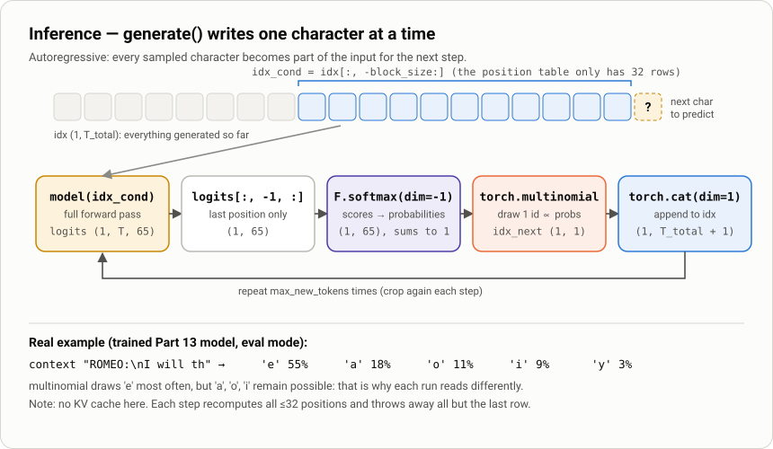
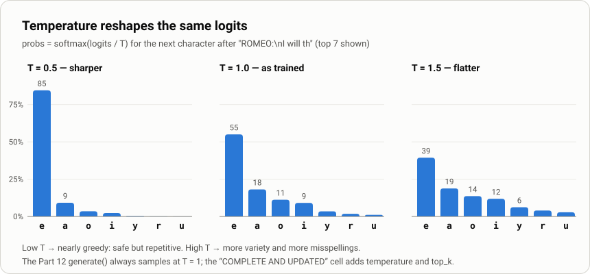

# 3. Inference: how the model writes text

> Notebook: [`src/Chapter_2__build_GPT_from_scratch.ipynb`](../../src/Chapter_2__build_GPT_from_scratch.ipynb): `GPTLanguageModel.generate` (Part 12), the last lines of Part 13, and the "Load the model" cells after **STOP**
> Previous: [2. Training](02-training.md)

The trained model can only do one thing: given some characters, produce scores for the next character. **Generation calls that one operation in a loop.** Each loop predicts a distribution, samples one character from it, appends that character, and repeats. This is called *autoregressive* generation: the model's own outputs become its next inputs.



---

## `generate()`, line by line

```python
def generate(self, idx, max_new_tokens):
    for _ in range(max_new_tokens):
        idx_cond = idx[:, -block_size:]                     # 1. crop
        logits, _ = self(idx_cond)                          # 2. forward  -> (B, T, 65)
        logits = logits[:, -1, :]                           # 3. last position -> (B, 65)
        probs = F.softmax(logits, dim=-1)                   # 4. probabilities
        idx_next = torch.multinomial(probs, num_samples=1)  # 5. sample -> (B, 1)
        idx = torch.cat((idx, idx_next), dim=1)             # 6. append -> (B, T+1)
    return idx
```

`idx` is a `(B, T)` tensor of token ids, the *prompt*. `B` is usually 1 for generation. The function returns the prompt plus `max_new_tokens` new ids.

### 1. Crop to the last `block_size` characters

```python
idx_cond = idx[:, -block_size:]
```

The model has a hard input limit. `position_embedding_table` has exactly `block_size` (32) rows, and each `Head`'s causal mask is `block_size × block_size`. Once `idx` grows past 32 characters, only the most recent 32 are passed in. Without the crop, the 33rd step fails: on CPU, PyTorch raises `IndexError: index out of range in self`; on GPU, the out-of-range lookup can crash the kernel.

This is the model's **context window**: it never sees text older than 32 characters. It can't, for example, remember which character is speaking once their name has scrolled out of the window.

### 2. Forward pass with no targets

```python
logits, _ = self(idx_cond)        # targets=None, so loss is None
```

This is the same `forward` used in training (see [the model doc](01-gpt-language-model.md)). It returns logits for **every** position, `(B, T, 65)`.

### 3. Keep only the last position

```python
logits = logits[:, -1, :]         # (B, 65)
```

Position `t`'s logits predict character `t+1`. Only the prediction after the last real character is new information. The other `T−1` rows predict characters already in `idx`, so they are discarded.

> This is wasteful: every step recomputes all ≤32 positions to use one row. Production LLMs avoid it with a **KV cache** (they store each position's keys and values and process only the new token). With a 32-character context it doesn't matter.

### 4. Logits → probabilities

```python
probs = F.softmax(logits, dim=-1)
```

Softmax exponentiates and normalizes, so the 65 scores become 65 probabilities that sum to 1. Higher logits give higher probabilities, and the gaps grow exponentially.

### 5. Sample, don't pick the max

```python
idx_next = torch.multinomial(probs, num_samples=1)
```

`torch.multinomial` draws one id at random, in proportion to `probs`. If `'e'` has probability 0.55, it is chosen about 55% of the time, not every time.

**Why not just take the `argmax`?** Greedy decoding always chooses the single most likely character. For a small character model that tends to fall into loops (`the the the …`), because the same context keeps producing the same choice. Sampling keeps the output varied. It is also why every run produces different text, unless you fix the seed with `torch.manual_seed`.

### 6. Append and repeat

```python
idx = torch.cat((idx, idx_next), dim=1)
```

The new character joins the sequence, and the next iteration predicts the character after it.

---

## A real step, with numbers

Using the model trained in Part 13 (eval mode), with the prompt `"ROMEO:\nI will th"`:

| next char | `'e'` | `'a'` | `'o'` | `'i'` | `'y'` | `'r'` | `'u'` | the other 58 |
|---|---:|---:|---:|---:|---:|---:|---:|---:|
| probability | 55.0% | 18.1% | 11.2% | 9.1% | 3.4% | 1.8% | 1.0% | ≈0.4% |

The model has learned that `th` after a space is followed by a vowel (`the`, `that`, `this`, `those`, `thy`) and almost never by a consonant or a space. Sampling picks `'e'` about half the time.

## Temperature and top-k

The Part 12 `generate()` always samples from the raw distribution. The "COMPLETE AND UPDATED" cell adds two common controls:

```python
def generate(self, idx, max_new_tokens, temperature=1.0, top_k=None):
    for _ in range(max_new_tokens):
        idx_cond = idx[:, -block_size:]
        logits, _ = self(idx_cond)
        logits = logits[:, -1, :] / temperature                       # reshape the distribution
        if top_k is not None:
            values, _ = torch.topk(logits, top_k)
            min_logits = values[:, -1].unsqueeze(-1)
            logits = torch.where(logits < min_logits, float('-inf'), logits)   # keep only the top k
        probs = F.softmax(logits, dim=-1)
        idx_next = torch.multinomial(probs, num_samples=1)
        idx = torch.cat((idx, idx_next), dim=1)
    return idx
```

- **Temperature** divides the logits before softmax. `T < 1` widens the gaps between scores, so the top choice gets more probability (safer, more repetitive). `T > 1` narrows them, making the distribution flatter (more creative, more misspellings). `T = 1` leaves the model's distribution unchanged.
- **Top-k** sets every logit outside the `k` best to `−inf` (probability 0). The model can then never choose a very unlikely character, no matter how many it samples.

The same `"ROMEO:\nI will th"` step at three temperatures:



---

## Doing inference properly: `eval()` + `no_grad()`

```python
model.eval()                                   # dropout OFF
with torch.no_grad():                          # no autograd graph
    context = torch.zeros((1, 1), dtype=torch.long, device=device)   # token 0 = '\n'
    out = model.generate(context, max_new_tokens=500)
print(decode(out[0].tolist()))
```

- **`model.eval()`** turns dropout off. In training mode, 20% of activations are randomly dropped on *every* forward pass, which adds noise to every prediction. The sample at the end of the Part 13 cell is generated this way, because `estimate_loss()` leaves the model in `train()` mode.
- **`torch.no_grad()`** stops PyTorch from recording a computation graph for 500 forward passes that will never be backpropagated. The output is the same, with less memory and time.
- **`torch.zeros((1, 1))`** is a one-character prompt containing id 0. In this vocabulary `chars` is sorted, so id 0 is `'\n'`: the model starts as if at the beginning of a line.

### Prompting with your own text

To steer the model, encode a string and pass it in as `idx`:

```python
prompt  = "ROMEO:\n"
context = torch.tensor([encode(prompt)], dtype=torch.long, device=device)   # (1, len(prompt))
with torch.no_grad():
    out = model.generate(context, max_new_tokens=200)
print(decode(out[0].tolist()))
```

Real output from the Part 13 model (`torch.manual_seed(7)`):

```text
ROMEO:
I weer! lord gest of you.

QUEEN:
Merry unfardsenced Them not
And me woelts dentrumme;
But wwere why is ther, not reass
```

The prompt directly influences only the next 32 characters. After that it has scrolled out of the context window, and only the generated text that followed carries its influence.

---

## Saving and loading for later inference

```python
torch.save(model.state_dict(), 'gpt_model.pth')        # weights only
```

A `state_dict` holds the **weights only, not the architecture**. To load it, first build a model with *exactly* the same class and hyperparameters (`n_embd`, `n_head`, `n_layer`, `block_size`, `vocab_size`), then copy the weights in:

```python
loaded_model = GPTLanguageModel().to(device)
loaded_model.load_state_dict(torch.load('gpt_model.pth', map_location=device))
loaded_model.eval()
```

`map_location=device` lets a checkpoint saved on a GPU load on a CPU-only machine. If any hyperparameter differs, `load_state_dict` fails with size-mismatch errors. It also needs the same `stoi`/`itos` character mapping, which here is rebuilt from `input.txt`.

The snippet above was tested against a checkpoint from the Part 13 run.

---

## Things to watch for in this notebook

1. **The "Load the model" cells call `BigramLanguageModel()`**, with no argument. That only works after running the "Full finished code" cell, which defines the GPT under that name. After Part 13 alone, `BigramLanguageModel` is still the Part 7 class, which requires `vocab_size`, so the cell raises a `TypeError`. Following Part 13, use `GPTLanguageModel()` as shown above.
2. **The paths are Colab paths** (`/content/gpt_model.pth`). When running locally, use the relative `gpt_model.pth` that the save cell writes.
3. **`generate_text_from_input` sets `context_size = block_size` but never uses it.** The cropping happens inside `generate()`.
